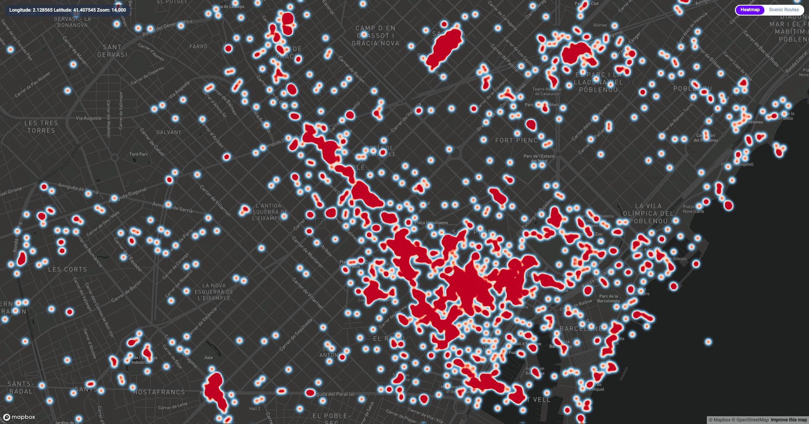
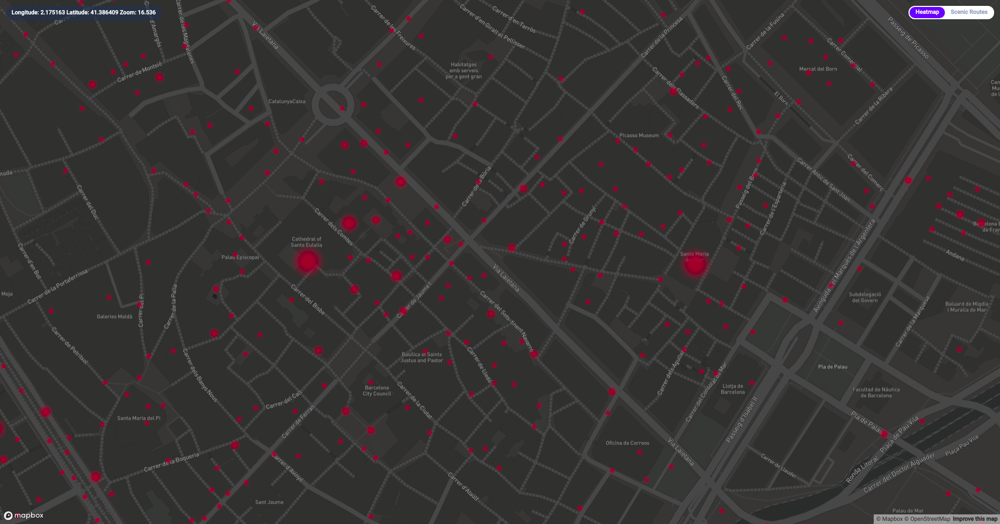
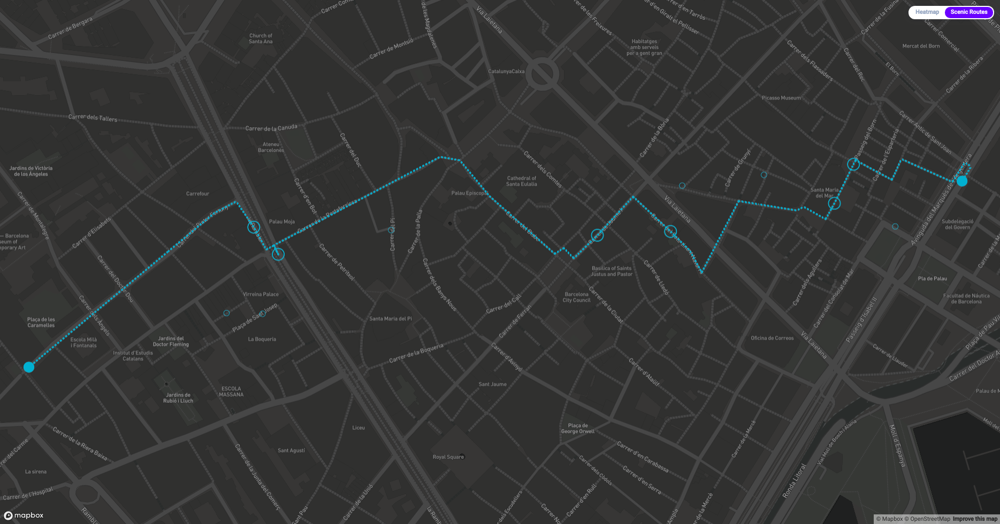

# Scenic Routes

## What is it?

You are new to a city. You want to go from A to B. However, the route between those two points is always the same: the shortest one. Taking the same route everyday is boring; I wanted new routes that make me see interesting stuff. Scenic Routes is a web application written in JavaScript that provides just that.

## Screenshots and details

<p align="center">
  
</p>

In the first view, you start with a heatmap of Barcelona representing the locations of the 10,000 most interesting Flickr pictures taken in that area.

---

<p align="center">
  
</p>

Zoom in, and the photos are clustered into interesting points. The more pictures have been taken at a point, the more interesting it is.

---

<p align="center">
  
</p>

In the second view, you can get routed through those points. The routing algorithm enforces some rules:
- The more interesting a point is, the more likely you will get routed through it.
- The longer the route, the wider the search radius is and the more interesting points you will be routed through.
- Detours are allowed, but the commute is still kept to a reasonable amount of time.

## Getting started

### Prerequisites

* You will need to get Flickr and Mapbox API keys.
* You need to have a redis database running.
* You will also need the [Scenic Routes client](https://github.com/leonhfr/scenic-routes-client) if you want any sort of useful interaction with the application.

### Installation

1. First, clone the repository and create a `.env` file as shown in `.env.example`:
```shell
git clone https://github.com/leonhfr/scenic-routes.git
cd scenic-routes
cp .env.example .env
# Atom or your favorite editor:
atom .env
# Adjust variables, add Flickr and Mapbox keys.
# Save the file.
```
2. If you run the app for the first time, you will need to build the database and the static GeoJSON files. Run `npm run first-time`
3. Then, to run the back-end `npm start`

## Tech stack

Front-end:
- [React](https://reactjs.org/)
- [Redux](https://redux.js.org/)
- [Mapbox](https://www.mapbox.com/)

Back-end:
- [Koa](https://koajs.com/)
- [Redis](https://redis.io/)
- [Turf.js](http://turfjs.org/)
- [OPTICS (density clustering)](https://github.com/uhho/density-clustering)

APIs:
- [Flickr](https://www.flickr.com/services/api/)
- [Mapbox](https://www.mapbox.com/)

## Author

Léon Hollender / [Github](https://github.com/leonhfr) / [LinkedIn](https://www.linkedin.com/in/leonhollender/)
